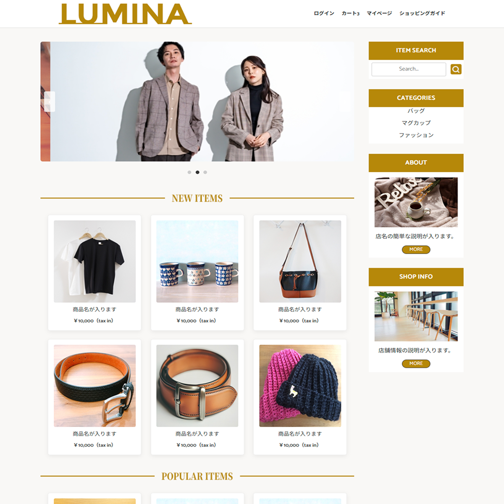
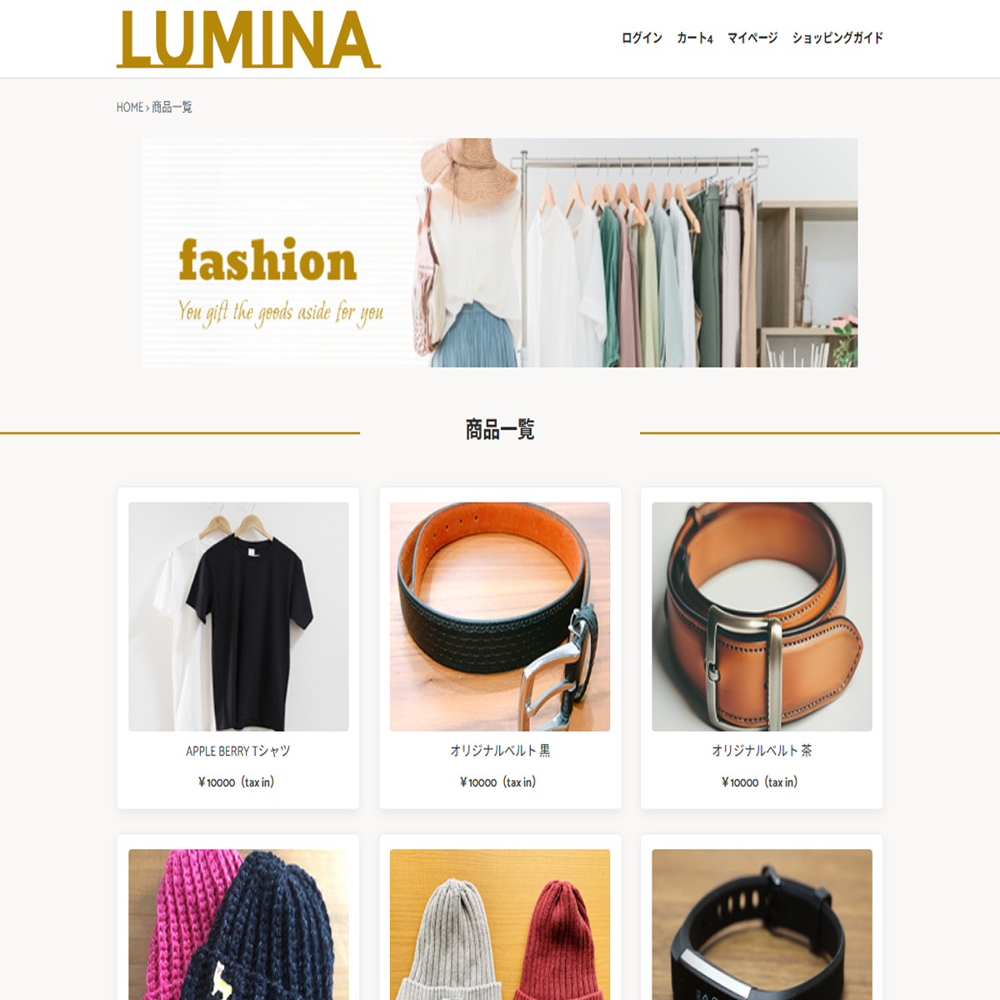
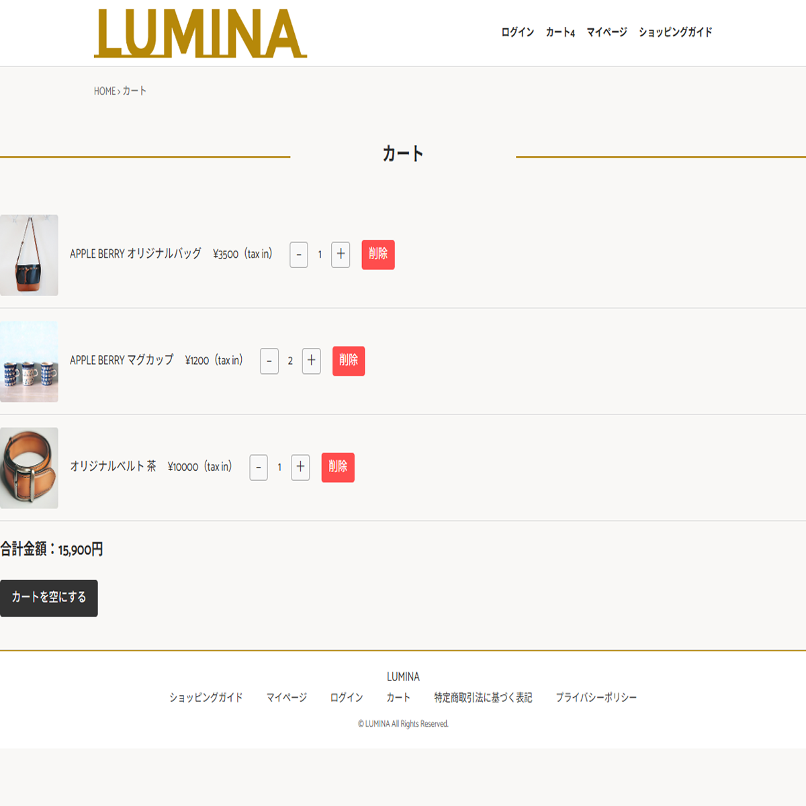

# LUMINA｜ECサイト（デモ）


架空ブランド「LUMINA」のオンラインストアを想定して制作した **デモ用 EC サイト** です。  
デザイン、HTML/CSS コーディング、JavaScript 実装、レスポンシブ対応、GitHub Pages 公開まで  
**フロントエンドをフルスクラッチで制作したポートフォリオプロジェクト**です。

実務的な EC サイトの構成を踏まえ、商品一覧・詳細・カートなど  
オンラインストアに必要な機能を一通り実装しています。

---

## 🔗 Repository  
https://github.com/yurato-design/lumina-ec-site

## 🌐 Demo  
https://yurato-design.github.io/lumina-ec-site/

---

## 📸 サイト概要  
本サイトは EC サイトの基本構成を踏まえ、以下のページで構成されています。

## 🖼 スクリーンショット

### TOPページ


### 商品一覧ページ


### 商品詳細ページ


### カートページ


### **TOP（index.html）**
- メインビジュアル（無限ループスライダー）
- NEW ITEMS / POPULAR ITEMS
- サイドバー（検索・カテゴリ・ABOUT・SHOP INFO）
- ショッピングガイド

### **商品一覧（list.html）**
- カテゴリ別の商品表示  
- JSON から商品データを読み込み  
- ページネーション対応  

### **商品詳細（products.html）**
- 商品情報を JSON から動的生成  
- サムネイル切り替え  
- カート追加  
- 最近見た商品を localStorage に保存  

### **カート（cart.html）**
- localStorage を利用したカート機能  
- 数量変更（＋／−）  
- 削除  
- 合計金額の自動計算  

### **下層ページ**
- ABOUT  
- SHOP INFO  
- ショッピングガイド（guide.html）  
- プライバシーポリシー（privacy.html）  
- 特定商取引法（tokusho.html）  
- マイページ（mypage.html）  

### **404ページ**
- 存在しないページにアクセスした際のエラーページ。

---

## 🛠 使用技術

### Frontend  
- HTML5  
- CSS3（Flexbox / Grid / メディアクエリ）  
- JavaScript（Vanilla JS）  
- Google Fonts（Noto Sans JP / Catamaran）  
- レスポンシブデザイン（PC / SP）  

### Data / Storage  
- JSON（商品データ管理）  
- localStorage（カート・最近見た商品）  

### Hosting  
- GitHub Pages  

---

## 📁 ディレクトリ構成
```
lumina-ec-site/
├── index.html
├── about.html
├── shopinfo.html
├── list.html
├── products.html
├── cart.html
├── guide.html
├── privacy.html
├── tokusho.html
├── mypage.html
├── login.html
├── 404.html
│
├── css/
│   ├── reset.css
│   └── style.css
│
├── js/
│   ├── menu.js
│   ├── cart.js
│   ├── list.js
│   ├── products.js
│   ├── search.js
│   └── slider.js
│
├── images/
│   └── （商品画像・バナー・アイコンなど）
│
└── products.json
```

---

## 🎨 デザインのポイント

- **ブランドカラー：#b68809**  
  サイドバーやタイトル帯に統一して使用。

- **商品カードのホバーアニメーション**  
  影・拡大アニメーションで視認性と操作感を向上。

- **レスポンシブ対応**  
  PC：2カラム構成  
  SP：1カラム＋ハンバーガーメニュー  

- **統一されたヘッダー／フッター／パンくず**  
  全ページで UI を統一し、実務的なサイト構造を再現。

- **下層ページは白カードデザインで読みやすく**  
  PC/SP どちらでも統一された見た目に。

---

## 🔍 SEO / 運用設定（任意）

※ EC サイトのため、必要に応じて追加可能。

### robots.txt（例）
```
User-agent: *
Allow: /

Sitemap: https://yurato-design.github.io/lumina-ec-site/sitemap.xml
```

### sitemap.xml（例）
```
<?xml version="1.0" encoding="UTF-8"?>
<urlset xmlns="http://www.sitemaps.org/schemas/sitemap/0.9">

  <url>
    <loc>https://yurato-design.github.io/lumina-ec-site/index.html</loc>
    <priority>1.0</priority>
  </url>

  <url>
    <loc>https://yurato-design.github.io/lumina-ec-site/list.html</loc>
  </url>

  <url>
    <loc>https://yurato-design.github.io/lumina-ec-site/products.html</loc>
  </url>

  <url>
    <loc>https://yurato-design.github.io/lumina-ec-site/about.html</loc>
  </url>

  <url>
    <loc>https://yurato-design.github.io/lumina-ec-site/shopinfo.html</loc>
  </url>

  <url>
    <loc>https://yurato-design.github.io/lumina-ec-site/cart.html</loc>
  </url>

  <url>
    <loc>https://yurato-design.github.io/lumina-ec-site/guide.html</loc>
  </url>

  <url>
    <loc>https://yurato-design.github.io/lumina-ec-site/privacy.html</loc>
  </url>

  <url>
    <loc>https://yurato-design.github.io/lumina-ec-site/tokusho.html</loc>
  </url>

  <url>
    <loc>https://yurato-design.github.io/lumina-ec-site/mypage.html</loc>
  </url>

  <url>
    <loc>https://yurato-design.github.io/lumina-ec-site/login.html</loc>
  </url>

</urlset>
```

---

## 🔧 今後の改善案（任意）

- 商品検索機能の強化（曖昧検索 / サジェスト）  
- 商品レビュー機能  
- お気に入り機能  
- カートページの UI 改善  
- API 化（バックエンド連携）  
- 管理画面（CMS）との連携  

---

## 📜 ライセンス  
本プロジェクトは **個人制作のデモサイト** です。  
画像素材の無断転載はご遠慮ください。